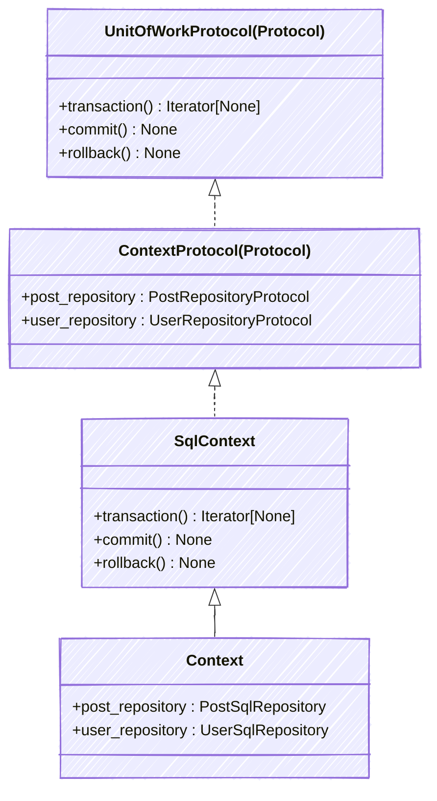

# Webapp Clean Architecture

## Architecture rules

- The `Domain` class is injected into API routes via FastAPI’s `Depends` mechanism
  to expose all business commands through a single interface.
- API routes should call only one domain command to have only one unit of work per request.

## Context



## Installation (*SQL Database*)

### Pre-requisites
Make sure you have `uv` and `just` installed

1. Clone the repository
2. Install dependencies and pre-commit hooks
    ```shell
    just init
    ```
3. Create a `.env` file in the root directory with the following values:
    ```
    POSTGRES_USER
    POSTGRES_PASSWORD
    POSTGRES_HOST
    POSTGRES_PORT
    POSTGRES_DB
    ```
4. Run the database container
    ```shell
    just postgres-dev <port>
    ```
5. Run the migrations
    ```shell
    just migrate
    ```
6. Run the application
    ```shell
    just run-app <port>
    ```
